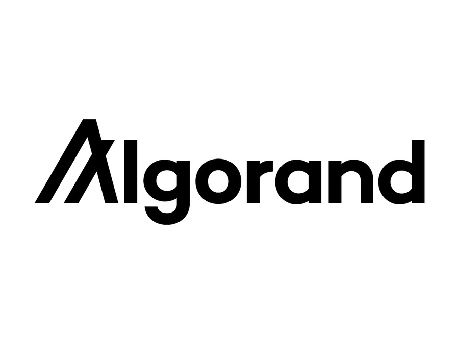

## 2. Find Any Data Through Advanced LLM

Our search model assistant includes a unique integration of latest frameworks such as LangChain, Vector Database and AWS scalable architecture. Below we have a high level overview of our architecture:

## Current Setup

### LLM Smart Assistant

The LLM Smart Assistant is an integral part of our platform, facilitating data discovery and analysis through conversational AI. The following components make up the LLM Smart Assistant:

- **LLM (Language Model):** We utilize OpenAI's gpt-3.5-turbo-0613 for processing natural language queries and generating human-like text. This advanced model allows for accurate interpretation and generation of content, enabling seamless user interactions.

- **Sentence to Embedding:** Our sentence transformer is hosted on an AWS Sagemaker Endpoint, specifically on an `ml.t2.medium` instance. This service converts sentences into meaningful vector embeddings, aiding in the efficient retrieval of data sets by their semantic content.

- **VectorDB:** We leverage AWS Aurora with a PostgreSQL-compatible database that includes the pgvector extension. This allows us to store and search through high-dimensional data embeddings, facilitating rapid and relevant data retrieval.

- **Langchain:** AWS Lambda functions, equipped with the Langchain library, orchestrate the interaction between the LLM and other components. They handle tasks such as query processing, security checks, and maintaining the flow of the conversation with the user.

### LLM Dataset to Description (In Development)

Our ongoing development includes an LLM for converting datasets into descriptive summaries:

- **LLM (Language Model):** Similar to the Smart Assistant, this component utilizes OpenAI's gpt-3.5-turbo-0613 to interpret datasets and generate descriptive text that encapsulates the dataset's characteristics and insights.

- **Langchain:** Currently running on a local machine, Langchain is responsible for interfacing with the LLM. It will soon be migrated to AWS Elastic Container Service (ECS) to enhance scalability and performance in a production environment.

### LLM Dataset to Use Case (In Development)

Another development in progress is an LLM that maps datasets to potential use cases:

- **LLM (Language Model):** We are implementing Llama2:13B, running on an M1 Ultra with 128GB memory, for its capability to generate detailed use cases from dataset analysis, ensuring that insights are not only descriptive but also actionable.

- **Langchain:** Similar to the above components, Langchain runs on a local machine and will transition to AWS ECS for production deployment, ensuring a consistent and scalable environment across our LLM services.

Our architecture aims to provide a seamless and secure experience for users, enabling them to interact with data in a more natural and intuitive way. As we continue to develop and refine our LLM capabilities, our platform remains at the forefront of innovation in the data marketplace domain.

---

---
## Algorand Smart Contract Integration

To enhance the functionality and security of our data transactions, we are seamlessly integrating Algorand smart contracts within our LLM architecture, specifically in the transaction flow facilitated by the LLM Smart Assistant.

### Current Integration Steps:

1. **Smart Contract Logic:** Developing and deploying Algorand smart contracts to handle transaction logic, including data access control externally or internally.

2. **Langchain Interaction:** Updating AWS Lambda functions to interact with Algorand smart contracts, initiating and validating data transactions upon user requests processed by the LLM.

3. **Token Operations:** Incorporating Algorand Standard Assets (ASAs) for token management, aligning Langchain processes with ASA-related transactions.

4. **Data Security and Compliance:** Ensuring data integrity and access control by validating transactions with Algorand smart contracts before data delivery.

5. **API and User Interface:** Updating API Gateway and user interface components to reflect blockchain transaction capabilities and provide users with transaction status and wallet management options.

6. **Testing and Documentation:** Conducting comprehensive testing and provide user-focused documentation for understanding the new blockchain-based transaction system.

The abovementioned additions will enhance the search as it will provide immutable tracing and additional methods to manage wallet transactions while obtaining tokens for time, search and and interactions with our platform. 

We will dive in deeper in specific ways through which our platfrom will integrate smart contracts and governance protocols aligned with Algorand vision.

To check in more detail how users can monetize their data check [the following page](3-MonetizeData.md) ⬅️

