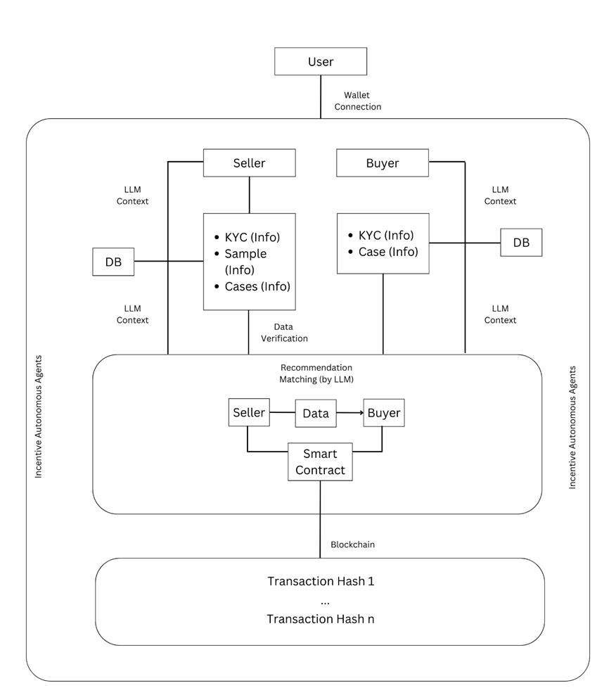
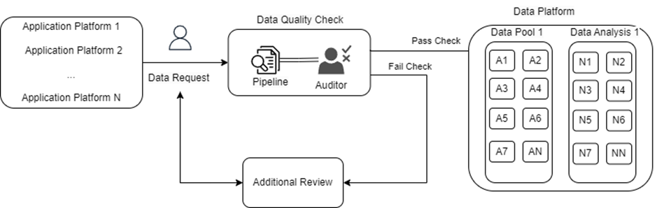

# Monetize Your Personal Data

On a high level, we encourage and teach users how they can get access and upload data from big platforms they use on the daily basis and monetize their data. We provide necessary research and price benchmarks to inform rates through which they can expect to monetize their data based on their platform.

   There are 2 ways in which users can monetize their data:
      
      a) Selling personal individual data (where they own 100% return)

      b) Part of analytics report or contribution derived from data analysis

   Before we explore Tokenomics in detail, we can see how the process will look like on a high level from the system architecture below.

## How It Works

1. **Data Contribution:**
   - **Know Your Client (KYC):** Users undergo a KYC process to ensure trust and compliance. During this phase, users provide necessary background information, which is securely stored and processed.
   - **Data Submission:** Users contribute their data to the platform, which can include various types of personal or generated data, structured in a manner that maintains privacy while still being valuable for analysis and insights.

2. **Smart Contracts and Data Access Control:**
   - **Access Control:** Smart Contract-Based Access Control (SC-RBAC) is utilized to regulate who can access the contributed data. Permissions are set and enforced by smart contracts, with terms predefined by data contributors.
   - **Data Verification:** Data samples are verified through a combination of automated processes and manual audits to ensure quality and relevance. This step is crucial for maintaining the integrity of the data marketplace.

  

3. **Data Monetization:**
   - **Matching with Buyers:** Using our advanced LLM algorithms, we match the contributed data with potential buyers – businesses or researchers looking for specific datasets.
   - **Secure Transactions:** When a match is found, the transaction is facilitated by a smart contract on the blockchain, ensuring secure exchange of data and funds. The terms of the transaction, including price and data access, are encoded within the smart contract.

4. **Token Allocation and Incentives:**
   - **Revenue Generation:** Upon a successful transaction, users receive compensation in the form of tokens or digital currency, as specified in the smart contract.
   - **Token Usage:** Tokens can be used within the platform for various services, traded, or converted to other forms of currency depending on the platform's capabilities and user preference.

5. **Governance and Compliance:**
   - **Data Pool Validation:** Data pools undergo validation to ensure they meet the platform's standards and compliance requirements.
   - **Regulatory Adherence:** The platform's architecture is designed to adhere to global data protection and privacy laws, providing users with the assurance that their data is managed responsibly.

## Benefits for Users

- **Control and Ownership:** Users retain full control over their data and can set the terms under which it is accessed or used.
- **Passive Income Stream:** By contributing data, users can create a new passive income stream with minimal effort.
- **Transparency and Security:** All transactions are transparently recorded on the blockchain, providing an immutable record of usage and compensation.
- **Privacy Protection:** Our platform prioritizes user privacy, employing advanced encryption and anonymization techniques to protect personal information.

In summary, our platform empowers users to safely and conveniently monetize their personal data, tapping into the growing demand for data while ensuring security, privacy, and compliance. Through our blockchain-powered marketplace, users can contribute data, engage in transparent transactions, and receive fair compensation, all underpinned by a robust framework of incentives and governance.

---

In the front-end, the user experience will be seamless, where users only have to worry about connecting their account/wallet and upload data while the platform takes care of the rest.

Another integral part of the platform is the data analytics contributors - experts in data analytics/science who after being approved by the community can shape the data into insights in form of clean data, reports etc.

For a high level overview of how they can interact with the platform can check [the following page](4-InsightsContributor.md) ⬅️

