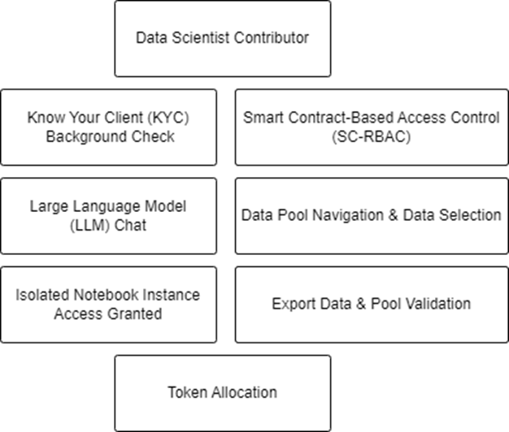

# Earn Through Contributing Insights

Our platform empowers Data Analytics Specialists to contribute their expertise to the ecosystem. Following a community-driven review process, approved contributors gain access to decentralized data pools for analysis. This section outlines the steps and systems in place for such contributors.

The process is simple. Anyone can apply through a standard process to contribute analytics to the platform and data providers can select or not through voting. 

If approved, the Data Analytics Contributor can then have access, for a certain limited time and amount of resources access data from the data pool and perform manipulations (reports, dashboards or cleaning) and then output to the analytics section of data pool.

Tokens will then we distributed accordingly (we will dive in deeper on that throughout the tokenomics section).

Below we have a high level system architecture representation:

## Application and Approval

1. **Community Review:**
   - **Application Submission:** Analytics specialists apply through the platform by submitting their credentials and a statement of intent.
   - **KYC Compliance:** Applicants undergo a Know Your Client (KYC) process to verify identity and professional background.
   - **Community Vetting:** The application is reviewed by the platform community, ensuring that only qualified individuals are granted access to data.

## Data Pool Access and Analysis

1. **Data Pool Navigation:**
   - **Smart Contract-Based Permissions:** Once approved, specialists are granted access via Smart Contract-Based Access Control (SC-RBAC), which ensures data security and compliance with user permissions.
   - **Data Pool Selection:** Specialists can navigate and select from various data pools, such as a collection of Netflix user datasets, based on their area of expertise or interest.

2. **Analytics Environment Setup:**
   - **Provisioned Resources:** Approved specialists are provided with a SageMaker instance, tailored with the necessary tools and limited rights specific to the data pool they are working with.
   - **Environment Constraints:** The analytics environment comes with predefined time limits and resource allocations to ensure fair usage and availability.

## Analytics and Contribution

1. **Data Manipulation and Analysis:**
   - **Data Importation:** Specialists can import datasets from the assigned data pool into their SageMaker environment.
   - **Data Processing:** They perform data cleaning, feature engineering, and predictive analytics within the platform's operational guidelines.
   - **Insight Generation:** Specialists can create visualizations, dashboards, and models that contribute to the collective intelligence of the data ecosystem.

2. **Token Allocation:**
   - **Value Creation:** The value generated through analysis, insights, and models is quantified and compensated through token allocation.
   - **Smart Contract Execution:** Token distribution is automated by smart contracts, which calculate the allocation based on the contribution's impact and adherence to the platform's standards.

## Data Export and Validation

1. **Data Export Process:**
   - Upon completion of the analysis, specialists can submit their insights and derived datasets for export, subject to platform guidelines.
   - Exported data and insights undergo a validation process to ensure they meet data quality standards and do not violate any privacy or security constraints.

2. **Community Feedback and Iteration:**
   - The community reviews the contributions of analytics specialists, providing feedback and suggestions for improvement.
   - Specialists may iterate on their work, refining their analysis and contributions based on community input and data governance policies.

By participating in our platform, Data Analytics Specialists not only gain the opportunity to work with rich datasets but also contribute to the advancement of data science and analytics fields. Their contributions are vital to our ecosystem, driving forward the collective knowledge and application of data insights.

---

Now that we have a better understanding of the ecosystem is time to dig deeper in the Tokenomics surrounding all the contributing parties.

You can check the tokenomics in [the following page](5-Tokenomics.md) ⬅️