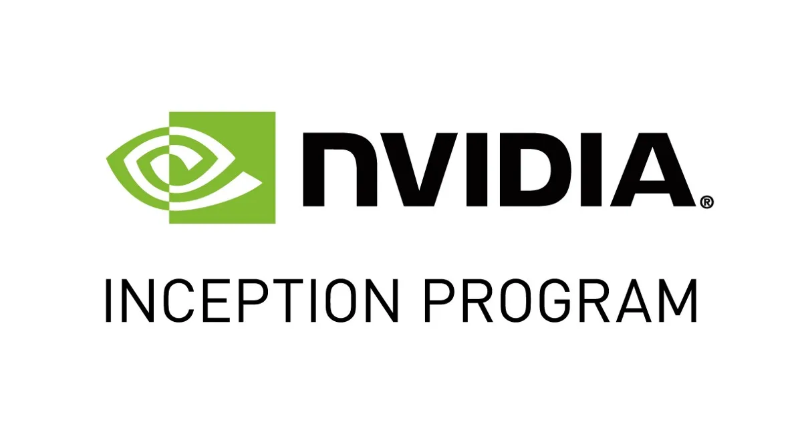
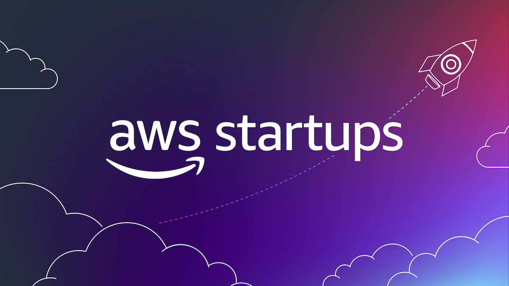
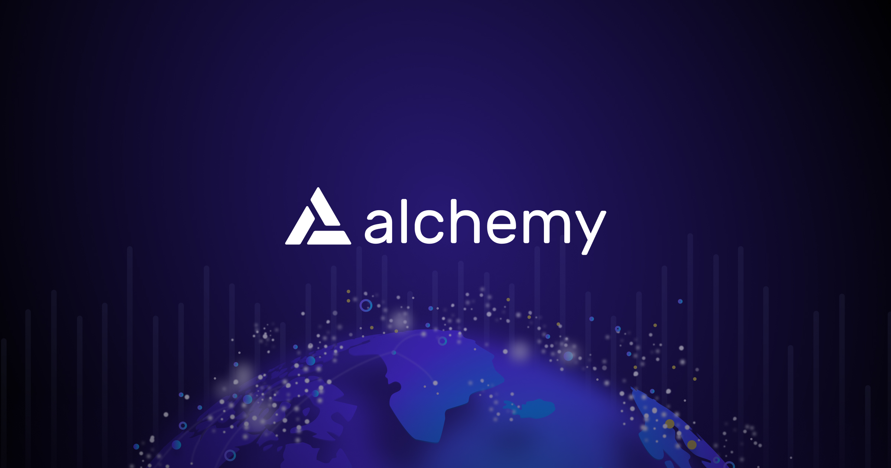

## **CognideX: A Decentralized Data Marketplace on Algorand**

CognideX is a one stop for all data exchange platform.

Here users can find any data available on the web, they can upload & monetize their data with our help or sign up as a Data Analytics provider and add their insights from the data pool available. 

All enhanced by Algorand Blockchain, Proprietary Data Watermarking & Empowering Tokenomics assisted by AI & driven by the community.

---

### Table of Contents
1. [Introduction](1-Introduction.md)
   - Overview of the marketplace and its unique selling points.
   - Integrating latest developments in the field of AI & Blockchain.

2. [Find Any Data Through Advanced LLM](2-LLMChat.md)
   - How we integrate LLM to find any data on the web.
   - Unique recommender through chat interface.
   - Integration with GPT4 Marketplace.

3. [Monetize Your Personal Data](3-MonetizeData.md)
   - How decentralized data pools work.
   - Security mechanisms and back end integrations.

4. [Earn Through Contributing Insights](4-InsightsContributor.md)
   - How users can apply and become a data analytics contributor in the platform.
     - Explaining platform integration on a high level.

6. [Deep Dive on Tokenomics](5-Tokenomics.md)
   - Overview of Algorand's features relevant to the marketplace.
   - Technical details of implementing the tokenomics on Algorand.

7. [Governance and Future Developments](6-Governance.md)
   - Mechanisms for governance and decision-making within the marketplace.
   - Plans for future development and potential adjustments to the tokenomics model.

---

## Currently Incubator & Partnering with the Following:

### - [NVIDIA Inception Program](https://www.nvidia.com/en-sg/startups/)

### - [AWS StartUps Program](https://aws.amazon.com/startups)

### - [Alchemy Ventures](https://www.alchemy.com/ventures)

**(And many more following in the future...)**

